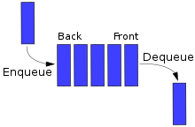

# 스택

## GIF



## 특징

- FIFO (First Input First Output)

## JS

```javascript
class Queue {
  constructor() {
    this._arr = [];
  }
  enqueue(item) {
    this._arr.push(item);
  }
  dequeue() {
    return this._arr.shift();
  }
}

const queue = new Queue();
queue.enqueue(1);
queue.enqueue(2);
queue.enqueue(3);
queue.dequeue();
```
